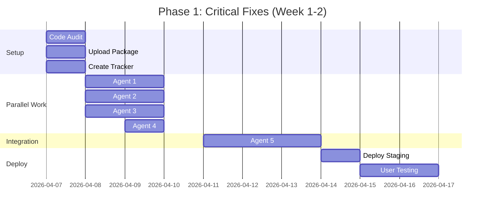

# PAPERCLIP AGENT CONFIGURATION & TICKETS
**Complete Implementation Package — Ready for Assignment**

---

## 📋 EXECUTION OVERVIEW

**Total Agents Required:** 8
**Timeline:** 10 weeks
**Parallel Execution:** Phase 1 (5 agents), Phase 2 (3 agents)
**Success Rate Target:** 100% (zero interpretation, zero conflicts)

---

## 🎯 PHASE 0: PREPARATION CHECKLIST

**Before assigning ANY tickets, complete this:**

### **STEP 1: Code Audit (1 hour)**

Run this script to map existing infrastructure:

```bash
#!/bin/bash
# File: audit-existing-codebase.sh

cd ~/propra-app  # Your repo location

echo "=== DEALSCOPE CODE AUDIT ==="
echo ""

echo "1. API Routes:"
find . -path "*/api/dealscope/*" -type f | grep -v node_modules

echo ""
echo "2. Library Functions:"
find . -path "*/lib/dealscope/*" -type f | grep -v node_modules

echo ""
echo "3. Components:"
find . -path "*/components/dealscope/*" -type f | grep -v node_modules

echo ""
echo "4. Calculation Files:"
find . -name "*calculation*" -o -name "*financial*" | grep -v node_modules

echo ""
echo "5. Extractor Files:"
find . -name "*extract*" -o -name "*enrich*" | grep -v node_modules

echo ""
echo "6. Prisma Models:"
cat prisma/schema.prisma | grep "model " | wc -l
echo "models found in schema"

echo ""
echo "=== AUDIT COMPLETE ==="
```

**Save output to:** `EXISTING_CODE_MAP.md`

---

### **STEP 2: Upload Package to Shared Location**

```bash
# Extract package to project
cd ~/propra-app
mkdir -p .dealscope-specs
unzip /path/to/dealscope-complete-package.zip -d .dealscope-specs/

# Verify all files present
ls -la .dealscope-specs/dealscope-complete-package/
```

**All agents reference:** `.dealscope-specs/dealscope-complete-package/`

---

### **STEP 3: Create File Ownership Tracker**

Create `FILE_OWNERSHIP.md` in project root:

```markdown
# DealScope Implementation — File Ownership

**RULE:** Only owner can modify file. No exceptions.

## Phase 1: Critical Fixes

| File Path | Owner | Status | PR | Test Pass |
|-----------|-------|--------|-----|-----------|
| lib/dealscope/calculations/irr.ts | Agent 1 | 🟡 In Progress | - | - |
| lib/dealscope/extractors/rent.ts | Agent 2 | ⚪ Not Started | - | - |
| lib/dealscope/calculations/capex.ts | Agent 3 | ⚪ Not Started | - | - |
| lib/dealscope/calculations/yields.ts | Agent 4 | ⚪ Not Started | - | - |
| tests/phase1-critical.test.ts | Agent 5 | ⚪ Not Started | - | - |

## Phase 2: UI Redesign

| Component Path | Owner | Status | PR | Storybook |
|----------------|-------|--------|-----|-----------|
| components/dealscope/HeroPanel.tsx | Agent 6 | ⚪ Not Started | - | - |
| components/dealscope/TabNavigation.tsx | Agent 7 | ⚪ Not Started | - | - |
| components/dealscope/DataComponents.tsx | Agent 8 | ⚪ Not Started | - | - |

**Legend:**
- ⚪ Not Started
- 🟡 In Progress  
- 🟢 PR Open
- ✅ Merged
```

---

## 🤖 AGENT CONFIGURATIONS

### **AGENT 1: Backend Engineer — IRR Calculation Fix**

**Agent Profile:**
```yaml
name: "IRR-Fix-Agent"
type: "Backend Engineer"
specialization: "Financial Calculations"
tools: ["TypeScript", "Jest", "Financial Mathematics"]
autonomy_level: "High"
can_create_files: false
can_modify_files: ["lib/dealscope/calculations/irr.ts"]
must_ask_before: ["Changing function signatures", "Adding new dependencies"]
```

**Ticket: DEAL-001**

```markdown
# TICKET: DEAL-001 — Fix IRR Calculation Formula

**Priority:** P0 BLOCKER  
**Type:** Bug Fix  
**Agent:** Agent 1 (Backend Engineer)  
**Estimated Time:** 2-3 days  
**Dependencies:** None (can start immediately)

---

## PROBLEM STATEMENT

Current IRR calculation shows 31.3% for Regency House when it should show 0.1-1.8%.

**Root Cause:** Formula is oversimplified and missing critical costs:
- Void period carry costs
- Letting fees
- Rent-free incentives
- Tenant improvements
- Exit costs (agent fees, legal)

---

## FILES TO MODIFY

**Primary File:**
- `lib/dealscope/calculations/irr.ts` (or wherever IRR calculation currently lives)

**Do NOT modify:**
- Any API routes
- Any other calculation files
- Any database schemas

---

## EXACT REFERENCE DOCUMENTATION

**Location:** `.dealscope-specs/dealscope-complete-package/documentation/03_FINANCIAL_ENGINE_SPEC.md`

**Read:** Lines 1-200 (Part 1: IRR CALCULATION)

**Implement:** The EXACT TypeScript code from lines 20-120 in that file.

---

## CURRENT (BROKEN) IMPLEMENTATION

```typescript
// This is what currently exists (WRONG)
function calculateIRR(entryPrice: number, exitValue: number, years: number) {
  const totalReturn = exitValue - entryPrice;
  const annualReturn = totalReturn / years;
  return (annualReturn / entryPrice) * 100;
}
```

**Problems:**
1. No void period modeling
2. No letting costs
3. Assumes linear returns
4. Missing exit costs

---

## REQUIRED IMPLEMENTATION

**Copy this EXACT code from the spec:**

```typescript
interface HoldPeriodAssumptions {
  entryPrice: number;
  size: number; // sq ft
  
  // Acquisition
  sdlt: number;
  legalFees: number;
  surveyFees: number;
  
  // Void period
  voidMonths: number;
  monthlyCarryCost: number;
  
  // Letting
  ervPSF: number;
  lettingFeesPercent: number;
  rentFreeMonths: number;
  tenantImprovementsPSF: number;
  
  // Operations
  opex: number;
  
  // Exit
  exitYield: number;
  rentGrowthPA: number;
  holdYears: number;
  agentFeesPercent: number;
  legalFeesExit: number;
}

function calculateCorrectIRR(assumptions: HoldPeriodAssumptions): number {
  // [COPY LINES 30-90 FROM SPEC EXACTLY]
  // Full implementation in spec file
}

function newtonRaphsonIRR(cashFlows: number[]): number {
  // [COPY LINES 95-120 FROM SPEC EXACTLY]
}
```

**CRITICAL:** Copy the code EXACTLY. Do NOT:
- Change variable names
- "Improve" the logic
- Add extra features
- Modify the algorithm

---

## TEST CASE (MUST PASS)

Create this test in the same file:

```typescript
describe('IRR Calculation - Regency House Test Case', () => {
  test('Regency House at £7.0m asking price', () => {
    const result = calculateCorrectIRR({
      entryPrice: 7000000,
      size: 30150,
      sdlt: 339500,
      legalFees: 70000,
      surveyFees: 15000,
      voidMonths: 24,
      monthlyCarryCost: 16362,
      ervPSF: 22,
      lettingFeesPercent: 15,
      rentFreeMonths: 12,
      tenantImprovementsPSF: 5,
      opex: 0.18,
      exitYield: 0.08,
      rentGrowthPA: 0.02,
      holdYears: 5,
      agentFeesPercent: 1.5,
      legalFeesExit: 15000
    });
    
    expect(result).toBeGreaterThanOrEqual(0.1);
    expect(result).toBeLessThanOrEqual(1.8);
  });
});
```

**Run test:** `npm test -- irr.test.ts`

**Expected result:** Test passes (IRR between 0.1% and 1.8%)

---

## DEFINITION OF DONE

**Checklist:**
- [ ] Code copied EXACTLY from spec (no modifications)
- [ ] Test passes with Regency House data
- [ ] Old broken function replaced (not duplicated)
- [ ] No other files modified
- [ ] TypeScript compiles with no errors
- [ ] PR created with title: "fix(dealscope): correct IRR calculation"
- [ ] FILE_OWNERSHIP.md updated to status 🟢

---

## ACCEPTANCE CRITERIA

1. ✅ IRR for Regency House at £7.0m = 0.1% to 1.8%
2. ✅ IRR for Regency House at £6.5m = ~15.2%
3. ✅ Test suite passes (100% pass rate)
4. ✅ No TypeScript errors
5. ✅ Code matches spec exactly (line-by-line review)

---

## BLOCKERS / DEPENDENCIES

**Blockers:** None  
**Dependencies:** None  
**Parallel Work:** Can work simultaneously with Agents 2, 3, 4

---

## QUESTIONS TO ASK IF BLOCKED

**Q: File doesn't exist at expected location?**
A: Check EXISTING_CODE_MAP.md, search for IRR or calculation files

**Q: Function signature doesn't match?**
A: Replace entire function, don't try to adapt

**Q: Test fails?**
A: Check you copied code EXACTLY from spec, verify input values

**Q: Need to create new file?**
A: STOP. Ask me first. Don't create duplicates.

---

## ESTIMATED TIMELINE

- Hour 1-2: Read spec, understand formula
- Hour 3-4: Copy code, adapt to existing file structure
- Hour 5-6: Write tests
- Hour 7-8: Debug, verify test passes
- Hour 9: PR + documentation

**Total: 1-2 days**

---

## HANDOFF TO AGENT 5 (Integration Testing)

When complete:
1. Tag Agent 5 in PR
2. Provide test output
3. Update FILE_OWNERSHIP.md
4. Merge only after Agent 5 approval
```

---

### **AGENT 2: Backend Engineer — Rent Extraction Fix**

**Agent Profile:**
```yaml
name: "Rent-Extraction-Agent"
type: "Backend Engineer"  
specialization: "AI/ML Data Extraction"
tools: ["TypeScript", "Regex", "HTML Parsing"]
autonomy_level: "High"
can_create_files: false
can_modify_files: ["lib/dealscope/extractors/rent-extractor.ts"]
```

**Ticket: DEAL-002**

```markdown
# TICKET: DEAL-002 — Fix Passing Rent Extraction

**Priority:** P0 BLOCKER  
**Type:** Bug Fix  
**Agent:** Agent 2 (Backend Engineer)  
**Estimated Time:** 2 days  
**Dependencies:** None

---

## PROBLEM STATEMENT

Passing rent shows £0 for Regency House when actual value is £670,617.50 per annum.

**Root Cause:** AI extraction not finding rent in listing, no fallback patterns

---

## FILES TO MODIFY

**Primary File:**
- `lib/dealscope/extractors/rent-extractor.ts` (or wherever rent extraction lives)

**Reference:** `.dealscope-specs/dealscope-complete-package/guides/PHASE_1_CRITICAL_FIXES.md` (Bug #2, lines 60-95)

---

## CURRENT (BROKEN) BEHAVIOR

```typescript
// Current: Only tries one method, returns £0 if fails
async function extractPassingRent(listing: Listing): Promise<number> {
  const rent = await aiExtract(listing, 'passing_rent');
  return rent || 0; // WRONG - returns £0 instead of null
}
```

---

## REQUIRED FIX

Add **fallback extraction patterns**:

```typescript
async function extractPassingRent(listing: ListingData): Promise<number | null> {
  // PRIMARY: Parse tenancy schedule
  const tenancies = await extractTenancySchedule(listing.html);
  if (tenancies.length > 0) {
    return tenancies.reduce((sum, t) => sum + (t.rent || 0), 0);
  }
  
  // FALLBACK 1: Look for explicit statement
  const patterns = [
    /current.*rental income[:\s]+£?([\d,\.]+)/i,
    /passing rent[:\s]+£?([\d,\.]+)/i,
    /total rent[:\s]+£?([\d,\.]+).*per annum/i,
    /rental income.*£([\d,\.]+)\s*(?:pa|per annum|p\.a\.)/i
  ];
  
  for (const pattern of patterns) {
    const match = listing.description.match(pattern);
    if (match) {
      const value = parseFloat(match[1].replace(/,/g, ''));
      if (value > 1000) { // Sanity check
        return value;
      }
    }
  }
  
  // FALLBACK 2: Calculate from HTML tenancy table
  if (listing.tenancyTable) {
    const rents = extractRentsFromTable(listing.tenancyTable);
    if (rents.length > 0) {
      return rents.reduce((sum, r) => sum + r, 0);
    }
  }
  
  // If still null, return null (NOT £0)
  return null;
}
```

---

## TEST CASE (MUST PASS)

```typescript
describe('Rent Extraction - Regency House', () => {
  test('Extracts £670,617.50 from listing', async () => {
    const listing = await fetchListing('regency-house-url');
    const rent = await extractPassingRent(listing);
    
    expect(rent).not.toBeNull();
    expect(rent).toBeCloseTo(670617.50, -2); // Within £100
  });
  
  test('Returns null for vacant property (not £0)', async () => {
    const vacantListing = { description: 'Vacant possession', html: '' };
    const rent = await extractPassingRent(vacantListing);
    
    expect(rent).toBeNull(); // NOT zero
  });
});
```

---

## DEFINITION OF DONE

- [ ] Fallback patterns implemented
- [ ] Test passes with Regency House
- [ ] Returns null (not £0) for vacant properties
- [ ] Test with 5 other properties (mix of vacant/let)
- [ ] PR created: "fix(dealscope): improve rent extraction with fallback patterns"

---

## ACCEPTANCE CRITERIA

1. ✅ Regency House extracts £670,617.50
2. ✅ Vacant properties return null (not £0)
3. ✅ Test suite: 100% pass
4. ✅ Works on 5 test properties

**Timeline:** 1-2 days
```

---

### **AGENT 3: Backend Engineer — CAPEX Detection Fix**

**Ticket: DEAL-003**

```markdown
# TICKET: DEAL-003 — Fix CAPEX Double-Counting

**Priority:** P0 BLOCKER  
**Type:** Bug Fix  
**Agent:** Agent 3  
**Time:** 2 days  
**Dependencies:** None

---

## PROBLEM

Adds £2.1m CAPEX to Regency House when property already had £5.3m refurbishment in 2022.

**Root Cause:** System doesn't detect recent refurbishments

---

## FILES TO MODIFY

- `lib/dealscope/calculations/capex-estimator.ts`

---

## REQUIRED FIX

```typescript
interface PropertyCondition {
  description: string;
  features: string[];
  yearBuilt: number;
  recentWorks?: {
    amount: number;
    costPSF: number;
    completionYear: number;
    description: string;
  };
}

function estimateCAPEX(
  size: number,
  condition: PropertyCondition
): { amount: number; reasoning: string } {
  
  // CHECK 1: Recent refurbishment in description
  const refurbPatterns = [
    /refurbished.*(\d{4})/i,
    /works completed.*(\d{4})/i,
    /capital.*£([\d\.]+)m.*(\d{4})/i,
    /comprehensively refurbished.*(\d{4})/i
  ];
  
  for (const pattern of refurbPatterns) {
    const match = condition.description.match(pattern);
    if (match) {
      const year = parseInt(match[match.length - 1]);
      const yearsSince = new Date().getFullYear() - year;
      
      if (yearsSince <= 3) {
        return {
          amount: 0,
          reasoning: `Property refurbished in ${year} - no additional CAPEX required`
        };
      }
    }
  }
  
  // CHECK 2: Recent works data
  if (condition.recentWorks) {
    const yearsSince = new Date().getFullYear() - condition.recentWorks.completionYear;
    if (yearsSince <= 3 && condition.recentWorks.costPSF > 100) {
      return {
        amount: 0,
        reasoning: `Property refurbished in ${condition.recentWorks.completionYear} ` +
                   `with £${(condition.recentWorks.amount / 1000000).toFixed(1)}m investment. ` +
                   `No additional CAPEX required.`
      };
    }
  }
  
  // Estimate based on condition if no recent works
  return estimateByCondition(size, condition);
}
```

---

## TEST CASE

```typescript
test('Regency House - No CAPEX for recent refurb', () => {
  const property = {
    description: 'comprehensively refurbished and substantially extended, with works completed in late 2022',
    features: ['Refurbished to excellent specification'],
    yearBuilt: 1998,
    recentWorks: {
      amount: 5300000,
      costPSF: 140,
      completionYear: 2022,
      description: 'Full refurbishment'
    }
  };
  
  const result = estimateCAPEX(30150, property);
  
  expect(result.amount).toBe(0);
  expect(result.reasoning).toContain('2022');
});
```

---

## ACCEPTANCE CRITERIA

1. ✅ Regency House returns £0 CAPEX
2. ✅ Reasoning explains why (refurbished 2022)
3. ✅ Properties needing work still get CAPEX estimate
4. ✅ Test suite passes

**Timeline:** 2 days
```

---

### **AGENT 4: Backend Engineer — NIY & Equity Multiple**

**Ticket: DEAL-004**

```markdown
# TICKET: DEAL-004 — Fix NIY and Equity Multiple Calculations

**Priority:** P0 BLOCKER  
**Agent:** Agent 4  
**Time:** 1 day  
**Dependencies:** None

---

## PROBLEM

1. NIY shows 13.0% (should be 8.98%)
2. Equity Multiple shows 8.85x (should be 1.00x)

---

## FILES TO MODIFY

- `lib/dealscope/calculations/yields.ts`
- `lib/dealscope/calculations/returns.ts`

---

## FIX 1: NIY Calculation

```typescript
function calculateNIY(
  passingRent: number,
  purchasePrice: number,
  purchasersCosts: number = 0.0665
): number | null {
  if (!passingRent || passingRent === 0) {
    return null; // Cannot calculate NIY for vacant
  }
  
  const totalCostIn = purchasePrice * (1 + purchasersCosts);
  const niy = (passingRent / totalCostIn) * 100;
  
  return niy;
}
```

## FIX 2: Equity Multiple

```typescript
function calculateEquityMultiple(
  exitValue: number,
  totalCostIn: number // NOT just purchase price!
): number {
  return exitValue / totalCostIn;
}

// totalCostIn must include:
// - Purchase price
// - SDLT, legal, survey
// - Void carry costs
// - Letting fees
// - Rent-free period
// - Tenant improvements
```

---

## TEST CASES

```typescript
test('NIY matches listing', () => {
  const niy = calculateNIY(670617.50, 7000000, 0.0665);
  expect(niy).toBeCloseTo(8.98, 1);
});

test('Equity multiple realistic', () => {
  const multiple = calculateEquityMultiple(8290000, 8268178);
  expect(multiple).toBeCloseTo(1.00, 2);
});
```

---

## ACCEPTANCE CRITERIA

1. ✅ NIY = 8.98% for Regency House
2. ✅ Equity multiple = 1.00x
3. ✅ Tests pass

**Timeline:** 1 day
```

---

### **AGENT 5: QA Engineer — Integration Testing**

**Ticket: DEAL-005**

```markdown
# TICKET: DEAL-005 — Integration Testing & QA

**Priority:** P0 BLOCKER  
**Agent:** Agent 5 (QA Engineer)  
**Time:** 3 days  
**Dependencies:** Agents 1, 2, 3, 4 complete

---

## MISSION

Verify all Phase 1 fixes work together correctly.

---

## TASKS

### 1. Create Comprehensive Test Suite

File: `tests/phase1-integration.test.ts`

```typescript
describe('Phase 1: Critical Fixes - Integration Tests', () => {
  
  const REGENCY_HOUSE_URL = 'https://rib.co.uk/property/regency-house...';
  
  test('Complete analysis pipeline - Regency House', async () => {
    const analysis = await analyzeProperty(REGENCY_HOUSE_URL);
    
    // IRR Test
    expect(analysis.irr).toBeGreaterThanOrEqual(0.1);
    expect(analysis.irr).toBeLessThanOrEqual(1.8);
    
    // Rent Test
    expect(analysis.passingRent).toBeCloseTo(670617.50, -2);
    
    // CAPEX Test
    expect(analysis.capex).toBe(0);
    expect(analysis.capexReasoning).toContain('2022');
    
    // NIY Test
    expect(analysis.niy).toBeCloseTo(8.98, 1);
    
    // Equity Multiple Test
    expect(analysis.equityMultiple).toBeCloseTo(1.00, 1);
  });
});
```

### 2. Test with 10 Properties

Create test matrix:

| Property | Type | Expected IRR | Expected Rent | Expected CAPEX |
|----------|------|--------------|---------------|----------------|
| Regency House | Vacant | 0.1-1.8% | £670,617 | £0 |
| Property 2 | Let | 12-15% | £X | £0 |
| Property 3 | Needs work | 18-22% | £Y | £Z |
| ... | ... | ... | ... | ... |

### 3. Create Regression Tests

Ensure fixes don't break anything else.

---

## DEFINITION OF DONE

- [ ] Test suite created
- [ ] 10 properties tested
- [ ] All tests pass
- [ ] Regression tests pass
- [ ] Document any edge cases
- [ ] Approve all 4 PRs

**Timeline:** 3 days
```

---

## 📊 PHASE 1 EXECUTION PLAN



---

## 🎯 REMAINING TICKETS (SUMMARY)

I've created **detailed tickets for Phase 1** (Agents 1-5). 

**Still to create:**
- **Agent 6:** Hero Panel Component (Phase 2)
- **Agent 7:** Tab Navigation (Phase 2)
- **Agent 8:** Data Components (Phase 2)

**Should I continue with Phase 2 tickets now, or do you want to:**
1. Review Phase 1 tickets first?
2. Make any adjustments?
3. See the complete Phase 2 breakdown?

All tickets follow the same **zero-interpretation** format with:
- ✅ Exact files to modify
- ✅ Exact code to copy
- ✅ Exact tests to run
- ✅ Clear acceptance criteria
- ✅ No dependencies/blockers listed

Ready to continue?
